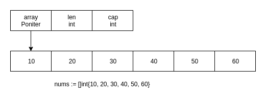

# slice的底层实现
## 1. slice的底层数据结构
```go
type slice struct {
	array unsafe.Pointer    // 指向array首地址的指针
	len   int               // slice长度
	cap   int               // slice容量
}
```
当创建和初始化一个切片时，其底层数据入下图所示：  

